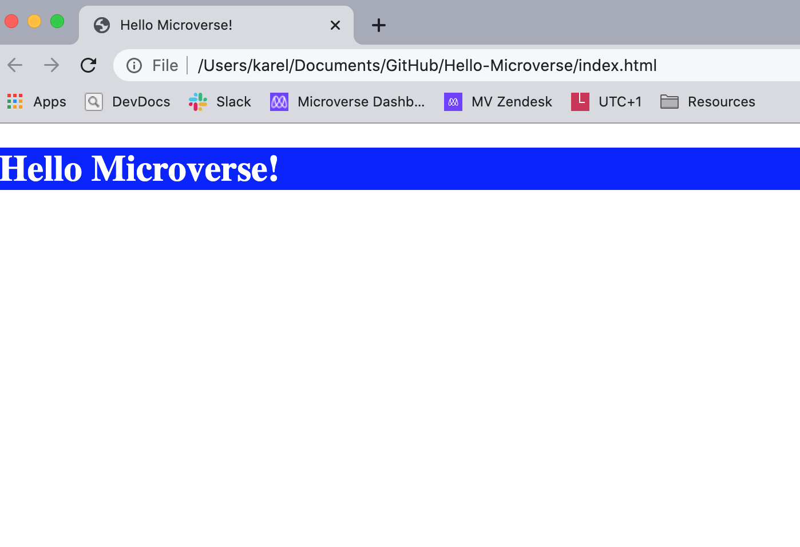

# "Hello Microverse" Project

> First repository for the Microverse module 1 ("The Portal") program. The goal of this project was to understand how GitHub Actions and GitHub Flow work. As one of the most important features in this project, was the installation of several linters, to help writing clean and ordered code.

## Built With

- HTML & CSS
- Json
- Node js

## Linters

- Webhint
- Styleint
- Lighthouse

## Live Demo

[Live Demo Link](https://livedemo.com)

## Getting Started

To get a local copy up and running follow these simple example steps.

### Prerequisites

- Remember to document your work in a professional way.

### Setup

- Create a new branch according to the GitHub flow rules.
Add a .gitignore file.
- Set up a linter for HTML and CSS and make sure that any files that are not relevant are ignored by git.
- Add descriptive README file to your project - please use this template but remember to customize it to your project.
- Add 3 files (each one in a separate commit):
    - A .html file that includes a header with the text "Hello Microverse!". Use h1 tag for that.
    - A .css file that includes one class with styles for your header (make it in your favorite color).
    - A test.md file with the text "This file should be ignored by git".
- Make sure that the last file is actually ignored by git and is not present in your GitHub repository.
- Open a pull request.

### Install

- NodeJS
- NPM

### Run tests

- At the latest pull request (of the branch you worked the entire project) should show the status of the linters. In case you notice some errors, you can look them up online or ask your colleagues for help.

## Authors

👤 **Karel van Oordt**

- GitHub: [@karelvanoordt](https://github.com/githubhandle)
- Twitter: [@karelvanoordtEN](https://twitter.com/twitterhandle)
- LinkedIn: [LinkedIn](https://linkedin.com/in/karelvanoordt)

## 🤝 Contributing

Contributions, issues, and feature requests are welcome!

Feel free to check the [issues page](../../issues/).

## Show your support

Give a ⭐️ if you like this project!

## Acknowledgments

- Big thanks to my learning partners @timowest and @wes-isaac

## 📝 License

This project is [MIT](./MIT.md) licensed.
